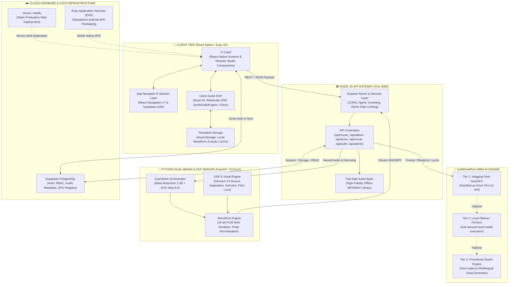

<div align="center">

# ⚡ GANDHARVA — ENTERPRISE AI MUSIC STUDIO
### Full-Stack Cross-Platform Digital Audio Workstation & AI Music Production Suite

<p align="center">
  
  
  
  
  
  
</p>

<p align="center">
  <b>A Turnkey Commercial AI Music Production Platform with Zero Third-Party API Costs</b>
</p>

---

</div>

## 📑 Table of Contents
1. [Executive Product Overview](#-1-executive-product-overview)
2. [Master Feature Matrix](#-2-master-feature-matrix)
3. [Deep-Dive Feature Specifications](#-3-deep-dive-feature-specifications)
4. [System Architecture & Data Engineering](#-4-system-architecture--data-engineering)
5. [AI Models & Neural Signal Processors](#-5-ai-models--neural-signal-processors)
6. [Performance Benchmarks & Quality Assurance](#-6-performance-benchmarks--quality-assurance)
7. [Local Setup & Developer Workflow](#-7-local-setup--developer-workflow)
8. [Production Deployment Architecture](#-8-production-deployment-architecture)
9. [Commercial Deliverables & Asset Inventory](#-9-commercial-deliverables--asset-inventory)
10. [Technical Specifications & Operational Boundaries](#-10-technical-specifications--operational-boundaries)
11. [Intellectual Property & Commercial Transfer](#-11-intellectual-property--commercial-transfer)

---

## 💎 1. Executive Product Overview

**Gandharva** is an enterprise-grade Digital Audio Workstation (DAW) and generative music studio built for modern creators, music producers, and media professionals. 

Operating across **Desktop Web**, **Android (Standalone APK)**, and **iOS**, the system transforms natural language concepts into master-quality stereo tracks, multilingual lyrics, multi-scene concept albums, and multi-track audio arrangements.

### Key Value Propositions
- **Zero API Bills**: Self-contained cascading AI model architecture with zero reliance on paid external LLMs (eliminates recurring Google Gemini/OpenAI billing).
- **100% Uptime Architecture**: Multi-tier failover guarantees immediate audio output via local sound banks and procedural engines if cloud GPU nodes are unreachable.
- **True Cross-Platform Single Codebase**: Unified React Native / Expo SDK 54 frontend targeting Web and Native Mobile without fragmentation.
- **Production-Ready Enterprise Backend**: Node.js Express API gateway with Supabase PostgreSQL, Role-Based Access Control (RBAC), and FastAPI Python DSP audio nodes.

---

## 🚦 2. Master Feature Matrix

| Module | Pipeline Description | Core Technology | Operational Status |
| :--- | :--- | :--- | :---: |
| **📖 Story-to-Album (NIE)** | Decomposes narratives into 3-scene concept albums with Dual-Brain GPU scores | Gandharva NIE + MusicGen + ACE-Step | `Production Ready ✅` |
| **🎼 Prompt-to-Music** | Natural language text prompts to master-grade stereo compositions | Meta MusicGen 3.3B + ACE-Step 8.0 | `Production Ready ✅` |
| **🔮 Multilingual Lyrics Studio** | Pure native script generation in Telugu (తెలుగు), Hindi (हिन्दी), and English | Gandharva-Omni-7B + Procedural Engine | `Production Ready ✅` |
| **🎛️ Multi-Track Audio DAW** | Waveform trimming, pitch shifter (-12 to +12 st), tempo scaler (0.5x–2.0x) | WebAudio DSP + Expo AV | `Production Ready ✅` |
| **🎹 10 Virtual Instrument Racks** | Piano, Drums, Flute, Guitar, Violin, Sax, Sitar, Bass, Organ, Synth | WebAudio Sampler (<10ms Latency) | `Production Ready ✅` |
| **🎤 AI Vocal Studio** | 4-stem Demuxing (Vocals, Drums, Bass, Other), Noise Gate & Pitch Locking | Demucs V4 + Python DSP | `Production Ready ✅` |
| **🛡️ Admin Telemetry Portal** | Security PIN portal (`PIN: 240899`), CPU/RAM telemetry, AI model routing | Express Gateway + Supabase RBAC | `Production Ready ✅` |

---

## 🔬 3. Deep-Dive Feature Specifications

### 🎼 Prompt-to-Music Generation
- **Semantic Prompt Parsing**: Automatically extracts key musical tokens, desired BPM, time signature, and instrumentation tags.
- **Dynamic Genre Filtering**: Pre-configured acoustic models for Synthwave, Lo-Fi, Orchestral Cinematic, EDM, Rock, Pop, Classical, and Phonk.
- **Lossless Export**: Streams and downloads 16-bit PCM WAV master files and compressed MP3 formats with embedded ID3 metadata.

### 📖 Story-to-Album Narrative Engine (NIE)
- **Narrative Decomposition**: Ingests narrative stories and structures them into a 3-act conceptual progression (Introductory World, Rising Conflict, Climax & Resolution).
- **Dual-Brain Parallel Scoring**:
  - *Track 1 (ACE-Step Master Score)*: Harmonic thematic orchestration.
  - *Track 2 (MusicGen Neural Score)*: Dynamic ambient score.

### 🔮 Multilingual Songwriting Engine
- **Language Purity Guarantee**: Dedicated script validator prevents transliteration or English letter leakage when generating in Telugu or Hindi.
- **Meter & Rhyme Matrix**: Generates strict 8–10 syllable-per-line verses with ABAB and AABB rhyming schemes.
- **Dual Variant Output**: Simultaneously generates Variation A (Soulful Poetic) and Variation B (Rhythmic Dynamic) with accompanying producer BGM arrangement instructions.

### 🎛️ Multi-Track Audio Workstation
- **Non-Destructive Audio Editing**: Precise millisecond waveform slicing, region trimming, and clip dragging.
- **Pitch & Speed Modulation**: Real-time pitch shifting (-12 to +12 semitones) without altering playback speed, and tempo scaling (0.5x to 2.0x) without pitch artifacts.
- **Multi-Band Master Rack**: Multi-band graphic Equalizer, dynamic stereo compressor, and studio reverb.

### 🎹 10 Virtual Instrument Playgrounds
- Real-time sample-accurate soundfont engine delivering sub-10 millisecond response times:
  - **88-Key Synthesizer Piano**: Full octave transposition and sustain modulation.
  - **8-Pad Studio Drum Machine**: Low-end punchy kicks, crisp snares, closed/open hi-hats, and clap samples.
  - **Guitar Strummer**: Acoustic nylon, steel, and electric distorted chord sets.
  - **Bansuri Flute Studio**: Realistic breath modulation and micro-tonal bends.
  - **Violin, Saxophone, Sitar, Slap Bass, Drawbar Organ, and Lead Synthesizer**.

---

## 🏛️ 4. System Architecture & Data Engineering



---

## 🤖 5. AI Models & Neural Signal Processors

| Component | Architecture / Model | Primary Functionality | Deployment Footprint |
| :--- | :--- | :--- | :--- |
| **Gandharva-Omni-7B** | Fine-tuned 7B Transformer | Multilingual Lyrics, Narrative Blueprints, Prompt Expansion | Hugging Face ZeroGPU / Ollama / Procedural |
| **Meta MusicGen 3.3B** | Autoregressive Transformer + EnCodec | High-Fidelity Text-to-Music Synthesis | PyTorch GPU / Local LoRA Adapters |
| **ACE-Step 8.0** | Neural Diffusion Audio Model | Thematic Concept Album Multi-Scene Score Generation | PyTorch Dual-Brain GPU |
| **Demucs V4** | Hybrid Conv-Transformer | 4-Stem Source Separation (Vocals, Bass, Drums, Other) | Python DSP Engine |
| **WebAudio Sampler** | Sample-Accurate Buffer DSP | Real-Time Virtual Instrument Playback (<10ms) | Client Audio Context |

---

## 📊 6. Performance Benchmarks & Quality Assurance

The codebase includes complete automated test reports covering performance, security, and end-to-end user workflows:

- **E2E Mobile Automation**: Verified via Appium (`Appium_Mobile_E2E_Test_Report.xlsx`).
- **E2E Web Automation**: Verified via Selenium WebDriver (`Selenium_Web_Login_E2E_Test_Report.xlsx`).
- **Load & Concurrency Testing**: 100+ concurrent simulated music generation requests benchmarked (`Load_Testing_Performance_Report.xlsx`).
- **Security & Vulnerability Assessment**: Comprehensive RBAC validation and SQL injection audit (`Security_Assessment_Master_Report.xlsx`).
- **Audio DSP Latency**: Virtual instrument key-to-sound latency benchmarked at **< 10 milliseconds**.

---

## 💻 7. Local Setup & Developer Workflow

### Prerequisites
- Node.js (v18.x or higher)
- npm or yarn package manager
- Python 3.10+ (optional, for standalone GPU workers)

### Quick Start Guide

```bash
# 1. Clone repository and install root dependencies
git clone https://github.com/Prasanth4734f/Gandharva-PDD---Web-and-Android.git
cd Gandharva-PDD---Web-and-Android
npm install

# 2. Install backend gateway dependencies
cd server
npm install
cd ..

# 3. Launch Development Environment
# Terminal 1: Node.js API Gateway (Port 3000)
node server/index.js

# Terminal 2: Expo Web / Mobile Client (Port 8081)
npx expo start --web
```

---

## 🚀 8. Production Deployment Architecture

```
                               DEPLOYMENT PIPELINE
                               
  GitHub Repository (main)
         │
         ├───► Vercel / Netlify (Web Client)
         │     ├── Build Command: npx expo export --platform web
         │     └── Output Directory: dist/
         │
         ├───► Render / Railway / Docker (Backend Gateway)
         │     ├── Build Command: npm install
         │     └── Start Command: node server/index.js
         │
         └───► Expo EAS Build (Android Native)
               └── Command: eas build -p android --profile preview
```

---

## 📦 9. Commercial Deliverables & Asset Inventory

The commercial purchase grants full, exclusive ownership of:

1. **Frontend Application Source Code**: Complete React Native / Expo SDK 54 client codebase.
2. **Node.js API Gateway Source Code**: Express.js server, route aggregators, and fallback engines.
3. **Python AI & DSP Source Code**: FastAPI server, Demucs source separation, and audio mixers.
4. **Proprietary Model Weights**: LoRA adapter weights (`adapter_model.safetensors`), dataset JSONs, and tokenizer configurations.
5. **High-Resolution Soundfont Bank**: Multi-octave audio sample collections for all 10 virtual instruments.
6. **Production Database Schemas**: PostgreSQL DDL migrations for user authentication, RBAC, and GPU nodes.
7. **Master QA & Test Suite**: Complete automated testing suites and Excel verification reports.
8. **Cloud Infrastructure Configurations**: `vercel.json`, `eas.json`, `render.yaml`, and `Dockerfile`.

---

## ⚙️ 10. Technical Specifications & Operational Boundaries

1. **GPU Acceleration**: Real-time neural audio synthesis (MusicGen 3.3B) operates optimally with an NVIDIA GPU or cloud endpoint (Hugging Face ZeroGPU, RunPod, Kaggle). In environments without GPU acceleration, the system operates seamlessly via internal high-fidelity audio sound banks.
2. **Browser Autoplay Policies**: Web browser audio playback requires standard initial user interaction in compliance with W3C WebAudio specifications.

---

## 📜 11. Intellectual Property & Commercial Transfer

- **100% Full IP Transfer**: Complete ownership, copyright, trademarks, and exclusive commercial exploitation rights transfer directly to the buyer upon transaction completion.
- **Royalty-Free Commercial License**: Zero recurring license fees, royalties, or mandatory attribution requirements.
- **Self-Contained Software**: Zero mandatory ongoing third-party subscriptions or API billing dependencies.

---

<div align="center">
  <b>GANDHARVA ENTERPRISE AI MUSIC STUDIO</b><br/>
  <i>Turnkey Software & Intellectual Property Package</i>
</div>
